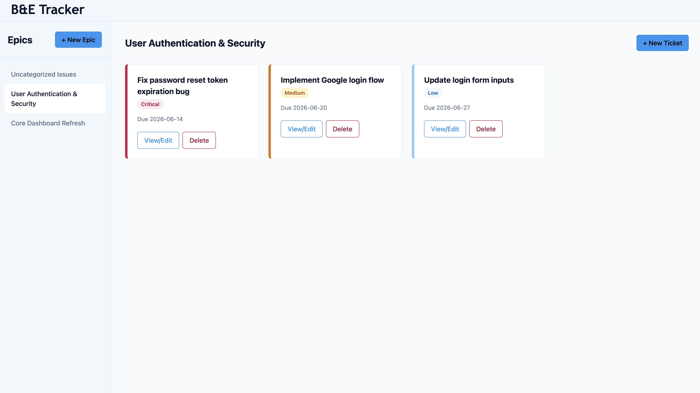
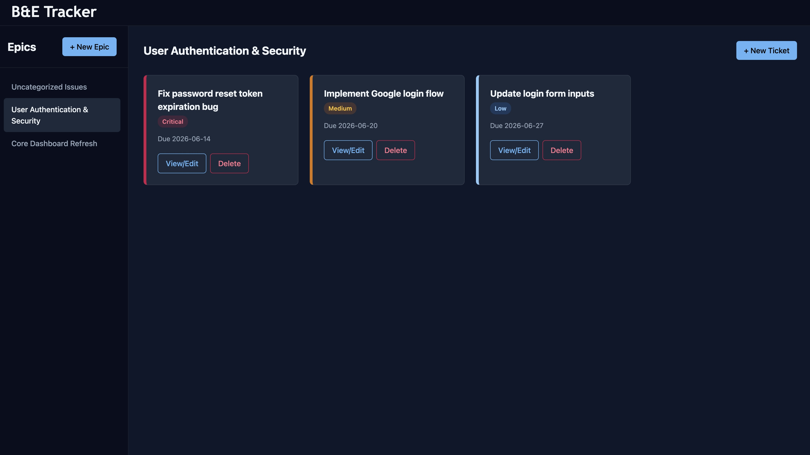
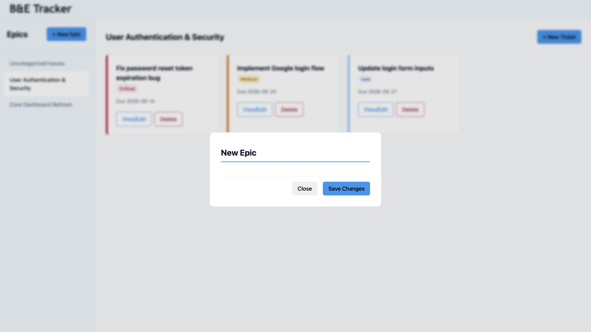
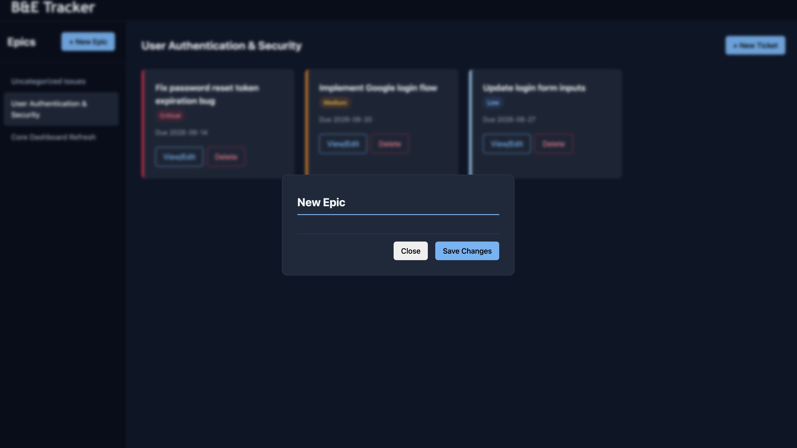
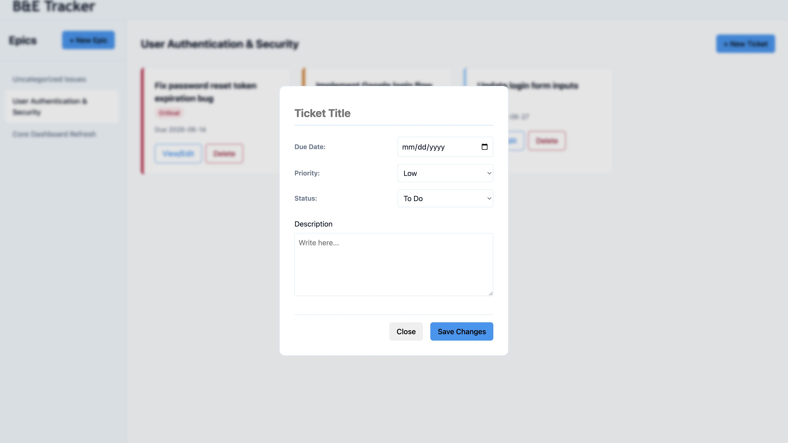
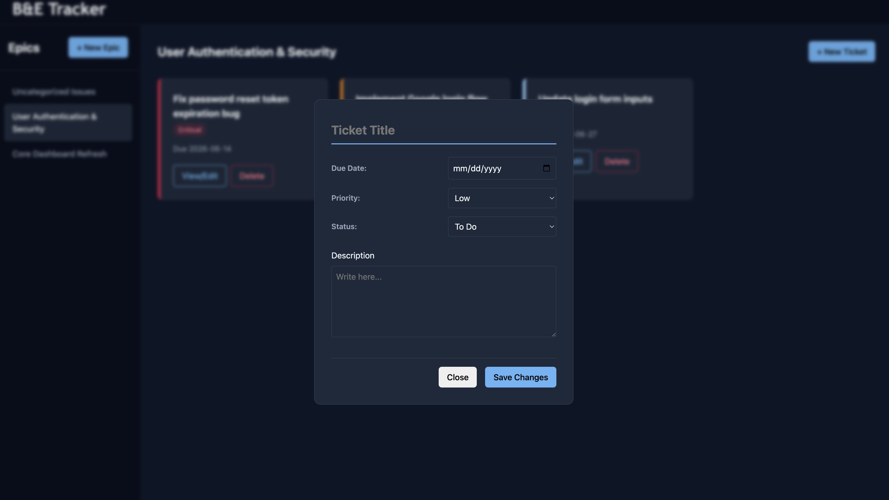

# B&E Tracker
**A modular, Webpack-bundled task management dashboard!**

## Visual Demonstration

| Light Mode | Dark Mode |
| :--- | :--- |
|  |  |
|  |  |
|  |  |

> **Note:** Automatically detects the system's theme settings and switches between Light and Dark mode instantly. 

## Key Features 
* **Dual-State Modal:** modal form dynamically scales between "Create" and "Edit" modes based on user selection. 
* **Priority System:** visual tags on tickets (Low, Medium, Critical).
* **Local Storage:** captures workspace data and backs them up locally. 

## Technical Decisions

### 1. Modular Architecture
* `models.js` acts as the data blueprint for the app. 
* `manager.js` handles logic and data mutations. 
* `dom.js` responsible for dynamic UI. 
* `index.js` listens for user interactions and passes instructions between `manager.js` and `dom.js`.

### 2. Webpack
* **Source Mapping:** used `eval-source-map` to ensure easy and accurate code tracking and debugging. 
* **Local Dev Server:** configured `webpack-dev-server` to automatically track updates and push reloads to the browser instantly. 

## How to Run This Locally 

1. Clone the repository to your local machine. 
2. Navigate into the project directory. 
3. Install dependencies: in your terminal, enter `npm install`.
4. Launch the Webpack local development server: in your terminal, enter `npm start`.
5. Navigate to `http://localhost:8080` (or the port specified in your terminal). 